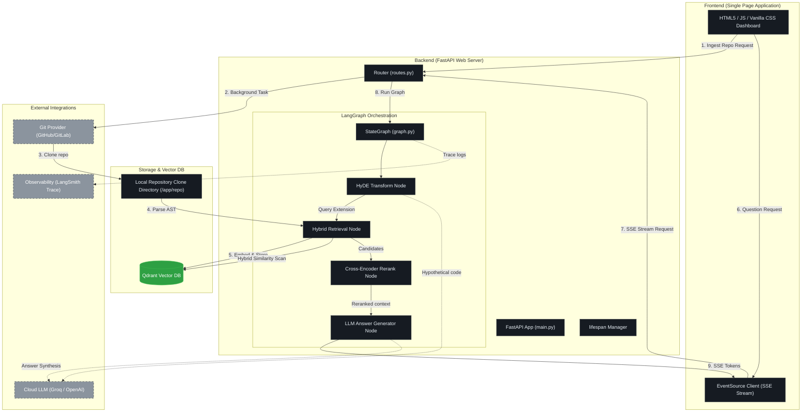

# CodeRAG: Production-Grade Source Code Analysis System

[](https://fastapi.tiangolo.com)
[](https://qdrant.tech)
[](https://github.com/langchain-ai/langgraph)
[](https://python.org)
[](LICENSE)
[](setup.py)

An advanced, production-ready Retrieval-Augmented Generation (RAG) system built to parse, index, and query codebases using deep semantic and syntactical understanding. By combining precise AST analysis with local Cross-Encoder reranking, CodeRAG delivers grounded, high-precision answers with full source attributions.

---

## 📖 Table of Contents

- [Project Overview](#-project-overview)
- [System Architecture](#%EF%B8%8F-system-architecture)
- [Application Flow & Request Lifecycle](#-application-flow--request-lifecycle)
- [Key Features](#-key-features)
- [Technology Stack & Design Decisions](#-technology-stack--design-decisions)
- [API Documentation](#-api-documentation)
- [Configuration Guide](#-configuration-guide)
- [Developer Experience & Installation](#-developer-experience--installation)
  - [Prerequisites](#1-prerequisites)
  - [Local Development Setup](#2-local-development-setup)
  - [Docker Multi-Container Setup](#3-docker-multi-container-setup)
  - [RAGAS Evaluation Run](#4-ragas-evaluation-run)
- [Project Quality & Production Readiness](#-project-quality--production-readiness)
  - [Security Architecture](#security-architecture)
  - [Performance Optimizations](#performance-optimizations)
  - [Observability & Monitoring](#observability--monitoring)
  - [Scalability Considerations](#scalability-considerations)
- [Contributing](#-contributing)
- [License](#-license)

---

## 🔍 Project Overview

### Problem Statement
Standard RAG systems struggle with source code because code is not plain prose. Arbitrary line-based splitting breaks functional context, while simple keyword matching fails to capture class-method inheritance, import dependencies, and developer intent. 

### Solution
**CodeRAG** resolves this by introducing a multi-stage parser and retrieval pipeline:
1. **Syntactic Chunking:** Employs Tree-sitter AST parsing to keep functions, methods, and classes intact as coherent semantic units.
2. **Hybrid Search:** Combines dense semantic vector matches with filename-targeted scroll filters to ensure file-specific questions always return relevant files.
3. **Hypothetical Document Embeddings (HyDE):** Translates natural language questions into hypothetical code snippets before querying Qdrant to align query-document vector space.
4. **Local CPU Reranking:** Narrows candidate pools using a highly optimized, local Cross-Encoder model.

---

## 🏗️ System Architecture

CodeRAG's system architecture separates concerns into a modular ingestion layer, a fast vector DB, an orchestrated state machine graph, and a highly responsive streaming API backend.



---

## 🔄 Application Flow & Request Lifecycle

The diagram below details the sequence of execution for repository indexing (ingestion) and real-time query answering (SSE streaming).

```mermaid
sequenceDiagram
    autonumber
    actor User as Developer
    participant UI as Browser SPA
    participant API as FastAPI Server
    participant Git as Git Client (pygit2)
    participant Parser as Tree-Sitter Parser
    participant DB as Qdrant DB
    participant Graph as LangGraph Engine
    participant LLM as LLM Provider (Groq/OpenAI)

    %% Ingestion Lifecycle
    rect rgb(20, 30, 45)
        Note over User, DB: Repository Ingestion Lifecycle
        User->>UI: Enter Git URL & Click 'Index Repo'
        UI->>API: POST /api/ingest {repo_url}
        API->>API: Clear previous vector collection
        API->>Git: Clone repository to local directory
        Git-->>API: Repository cloned successfully
        API->>Parser: Parse files (Tree-sitter AST for Python, Sliding-window for others)
        Parser-->>API: Returns list of CodeChunks with relative paths metadata
        API->>DB: Embed batches & Upsert into Qdrant
        DB-->>API: Chunks indexed successfully
        API->>API: Queue background folder deletion cleanup
        API-->>UI: Response: 200 OK (X chunks indexed successfully)
        UI-->>User: Show success badge & prompt to chat
    end

    %% Chat Lifecycle
    rect rgb(30, 20, 30)
        Note over User, LLM: Chat Query & Answer Generation Lifecycle
        User->>UI: Input question (e.g. "What does Class X do?")
        UI->>API: GET /api/chat?question=... (EventSource SSE)
        API->>Graph: Execute get_rag_graph().astream_events()
        
        %% Step 1: HyDE
        API->>UI: yield status: "🔍 Transforming query..."
        Graph->>LLM: Generate hypothetical code snippet (HyDE)
        LLM-->>Graph: Returns hypothetical code
        
        %% Step 2: Retrieve
        API->>UI: yield status: "📂 Searching codebase..."
        Graph->>DB: Perform dense semantic similarity search
        DB-->>Graph: Returns top-K code chunks
        opt Question contains filename hint
            Graph->>DB: Perform scroll filename filter search
            DB-->>Graph: Returns targeted chunks
        end
        Graph->>Graph: Merge and deduplicate candidates by (source, start_line)

        %% Step 3: Rerank
        API->>UI: yield status: "🎯 Reranking results..."
        Graph->>Graph: Run local CPU cross-encoder reranking (MiniLM)
        
        %% Step 4: Generate
        API->>UI: yield status: "💬 Generating answer..."
        Graph->>LLM: Stream synthesis using prompt + reranked context
        loop Token Stream
            LLM-->>Graph: Yield token chunk
            Graph-->>API: Capture event: on_chat_model_stream
            API->>UI: yield event: token (JSON-encoded content)
        end
        
        Graph-->>API: Graph execution complete
        API->>UI: yield event: done [DONE]
        UI-->>User: Render formatted markdown response
    end
```



---

## 🌟 Key Features

* **AST-Aware Python Parsing:** Utilizes Tree-sitter to identify Python classes, methods, and functions, keeping code objects self-contained with start/end lines and symbol signatures in the metadata.
* **Multi-Language Sliding Window:** Gracefully falls back to line-based sliding-window chunks (50 lines, 10 overlap) for JS/TS, Go, Rust, Java, C++, YAML, SQL, and Markdown.
* **LangGraph Orchestrated RAG State Machine:** Orchestrated through a robust state graph, making nodes traceable, modifiable, and deterministic.
* **Hybrid Retrieval (Dense + Metadatapath Filter):** Combines dense vector search with targeted filename query matching to guarantee retrieval of files explicitly named by the user.
* **Local mini-Cross-Encoder Reranking:** Re-scores vectors locally on the CPU using `cross-encoder/ms-marco-MiniLM-L-6-v2` in under 150ms, bringing state-of-the-art ranking precision with zero API expense.
* **100% Cost-Free Execution Mode:** Can run entirely offline using local ONNX embeddings (`FastEmbed`), local database (`:memory:`), and local LLMs (`Ollama`).

---

## 🛠 Technology Stack & Design Decisions

| Component | Technology | Rationale |
|---|---|---|
| **Core Web App** | FastAPI | Async lifespan, fast performance, automatic OpenAPI documentation generation. |
| **Orchestration** | LangGraph | State-machine style coordination of AI pipelines; clear observability and separation of concerns. |
| **Vector DB** | Qdrant | Highly efficient vector database with native support for payload scroll filters. |
| **Python AST** | Tree-sitter | High-fidelity Abstract Syntax Tree parsing that out-performs regex-based partitioners. |
| **Reranker** | SentenceTransformers | MiniLM model executes locally on CPU, avoiding API overhead and cost. |
| **Frontend** | Vanilla SPA | Zero build step, minimal footprint, robust EventSource SSE client integration. |

---

## 🔌 API Documentation

All API endpoints are prefixed with `/api` and return standardized JSON or Server-Sent Events.

### 1. Ingest Repository
* **Endpoint:** `POST /api/ingest`
* **Content-Type:** `application/json`
* **Request Schema:**
  ```json
  {
    "repo_url": "https://github.com/username/project-repo"
  }
  ```
* **Response Schema (200 OK):**
  ```json
  {
    "message": "Successfully indexed 142 code chunks.",
    "chunks_indexed": 142,
    "repo_url": "https://github.com/username/project-repo"
  }
  ```
* **CLI Example:**
  ```bash
  curl -X POST http://localhost:8080/api/ingest \
       -H "Content-Type: application/json" \
       -d '{"repo_url": "https://github.com/username/project-repo"}'
  ```

### 2. Stream Chat (SSE)
* **Endpoint:** `GET /api/chat`
* **Format:** Server-Sent Events (`text/event-stream`)
* **Query Parameters:**
  * `question`: The natural language query (max 2000 characters).
* **SSE Events Streamed:**
  1. `event: status` — Payload represents the currently executing node in the pipeline.
  2. `event: token` — JSON-encoded string representing a token chunk.
  3. `event: done` — Yielded at the end of the streaming pipeline.
* **CLI Example:**
  ```bash
  curl -N "http://localhost:8080/api/chat?question=How+is+database+configured?"
  ```

### 3. Non-Streaming JSON Chat
* **Endpoint:** `POST /api/chat`
* **Content-Type:** `application/json`
* **Request Schema:**
  ```json
  {
    "question": "Explain the parser module.",
    "chat_history": []
  }
  ```
* **Response Schema (200 OK):**
  ```json
  {
    "answer": "The parser module is located at src/ingestion/parser.py and contains..."
  }
  ```

### 4. Clear Vector Collection
* **Endpoint:** `DELETE /api/collection`
* **Response:** `{"message": "Collection cleared successfully."}`

### 5. Liveness Probe / Health Check
* **Endpoint:** `GET /api/health`
* **Response:** `{"status": "ok", "llm_provider": "groq", "embedding_provider": "fastembed", "qdrant_url": ":memory:"}`

---

## ⚙️ Configuration Guide

CodeRAG uses Pydantic Settings to load variables from environment. Copy `.env.example` to `.env` to configure.

| Environment Variable | Allowed Values | Default | Description |
|---|---|---|---|
| `LLM_PROVIDER` | `groq`, `openai`, `ollama` | `groq` | The LLM provider to use for synthesis. |
| `GROQ_API_KEY` | string | `""` | Required if LLM_PROVIDER is `groq`. |
| `GROQ_MODEL` | string | `llama-3.1-8b-instant` | Model for Groq. |
| `OPENAI_API_KEY` | string | `""` | Required if LLM_PROVIDER or EMBEDDING_PROVIDER is `openai`. |
| `OPENAI_MODEL` | string | `gpt-3.5-turbo` | Model for OpenAI. |
| `OLLAMA_BASE_URL` | url | `http://localhost:11434` | Target Ollama service API. |
| `OLLAMA_MODEL` | string | `llama3` | Local model pulls on Ollama. |
| `EMBEDDING_PROVIDER` | `fastembed`, `openai`, `voyage` | `fastembed` | Embedding generator. |
| `VOYAGE_API_KEY` | string | `""` | Required if EMBEDDING_PROVIDER is `voyage`. |
| `QDRANT_URL` | string / url | `:memory:` | `:memory:` for RAM; `http://localhost:6333` for server. |
| `QDRANT_API_KEY` | string | `""` | API authorization key for cloud/remote instances of Qdrant. |
| `QDRANT_COLLECTION` | string | `code_rag` | Target table/collection namespace. |
| `RETRIEVAL_TOP_K` | integer | `20` | Candidate count retrieved in Stage-1 semantic query. |
| `RERANK_TOP_N` | integer | `5` | Candidate count kept after Stage-2 MiniLM reranker. |
| `CHUNK_SIZE` | integer | `1500` | Target characters per sliding window chunk. |
| `CHUNK_OVERLAP` | integer | `200` | Target overlaps characters for split borders. |
| `ALLOWED_HOSTS` | comma-separated hosts | `github.com,gitlab.com` | Restricts SSRF vector targets during repo clone requests. |
| `CORS_ORIGINS` | comma-separated origins | `*` | Cors origin validation boundaries. Set explicit domain for prod. |
| `LANGCHAIN_TRACING_V2` | `true`, `false` | `false` | Enables trace capture exporting to LangSmith dashboard. |

---

## 🚀 Developer Experience & Installation

### 1. Prerequisites
System-level packages are required to compile and load libgit2 bindings (`pygit2`).

* **Linux (Debian/Ubuntu):**
  ```bash
  sudo apt-get update && sudo apt-get install -y libgit2-dev build-essential curl
  ```
* **macOS:**
  ```bash
  brew install libgit2
  ```

### 2. Local Development Setup
1. **Initialize Environment:**
   ```bash
   python3 -m venv venv
   source venv/bin/activate
   ```
2. **Install Dependencies:**
   ```bash
   pip install --upgrade pip
   pip install -r requirements.txt
   ```
3. **Configure Settings:**
   ```bash
   cp .env.example .env
   # Edit .env with your favorite LLM Keys
   ```
4. **Start Web Server:**
   ```bash
   uvicorn src.api.main:app --reload --port 8080
   ```
   Access the web interface at **`http://localhost:8080`**.

### 3. Docker Multi-Container Setup
The Docker setup is fully production-optimized:
- Pre-downloads and caches model weights inside `/app/.model_cache` during build time.
- Configures environment variables to redirect local weight caches to `/app/.model_cache` instead of the user's home folder.
- Runs as a non-root `appuser` for security.
- Integrates a persistent Qdrant service inside `docker-compose.yml`.

To build and spin up the complete containerized stack:
```bash
docker compose up --build
```
Access the application dashboard at **`http://localhost:8080`**.

### 4. RAGAS Evaluation Run
CodeRAG comes with a built-in golden dataset evaluator:
```bash
python -m src.evaluation.eval
```
This script computes context recall, answer relevancy, and faithfulness. It automatically reads settings and runs evaluation using the configured LLM and embedder (without crashing on OpenAI checks).

---

## 🔒 Project Quality & Production Readiness

### Security Architecture
1. **SSRF Mitigation:** The cloning utility checks repository domains against an allowed allowlist (`ALLOWED_HOSTS`). IP resolution checks block calls targeting localhost or private subnet CIDR spaces.
2. **Clean Metadata (Data Privacy):** The ingestion module strips local absolute system paths from chunks. All references are mapped relative to the repository root before vectorizing, ensuring that no internal hosting directories or user profiles are leaked to cloud LLM vendors.
3. **Least Privilege Process Ownership:** The Docker image runs under user `appuser` with no shell capability (`/bin/false`) and no root privilege escalation paths.
4. **XSS Protection:** The UI escapes characters (`<`, `>`, `&`) before formatting output blocks to prevent scripts from executing inside LLM chat bubbles.

### Performance Optimizations
1. **Model Cache Pre-loading:** FastEmbed (`BGE-small`) and SentenceTransformers (`MiniLM`) model weights are written directly into the image filesystem at build time. First-request responses take <3s compared to >2m for dynamic weight downloads.
2. **Thread Isolation for CPU Models:** Local embedding and Cross-Encoder reranking are wrapped in `asyncio.to_thread` calls to run in external thread pools, preventing heavy CPU tensor matrix calculations from blocking FastAPI's single-threaded event loop.
3. **Memory Batching:** Vectors are embedded and pushed to Qdrant in configured block sizes (default `64`). This maintains low memory overhead (<1 GB RAM) during ingestion of larger code repositories.

### Observability & Monitoring
CodeRAG supports **LangSmith** out of the box. Set `LANGCHAIN_TRACING_V2=true` in `.env` to capture execution traces, node latency details, prompt formats, and model costs.

### Scalability Considerations
1. **Transient Clone Cleaning:** Repository directories are deleted immediately after indexing is complete via FastAPI's `BackgroundTasks`, keeping disk requirements minimal.
2. **Stateless App Nodes:** The application container is entirely stateless. You can scale horizontally by adding replicas behind a load balancer and binding them to a shared remote Qdrant database cluster.

---

## 🤝 Contributing

We welcome contributions to CodeRAG!
1. Fork the repository.
2. Create your feature branch (`git checkout -b feature/cool-feature`).
3. Commit your changes (`git commit -m 'Add some cool feature'`).
4. Push to the branch (`git push origin feature/cool-feature`).
5. Open a Pull Request.

---

## 📄 License

Distributed under the MIT License. See [LICENSE](LICENSE) for more details.
